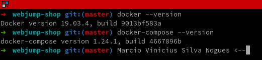
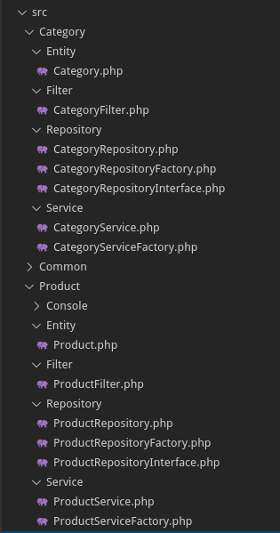

# WEBJUMP - Shop

Esse é um projeto classificatório para atuar como Desenvolvedor **Magento PHP** na [WEBJUMP](https://webjump.com.br/).

Nessa pequena documentação você encontrará exemplos de (1) como subir a aplicação com o Docker e acessá-la, (2) quais foram os componentes usados e (3) um pouco mais sobre a modelagem do código.

## Infraestrutura Docker

Como dito anteriormente, para rodar a aplicação foi usado o Docker e o [Docker Compose](https://docs.docker.com/compose/).

Versões usadas (para o teste) do Docker e Docker Compose:



### Imagens

Eu usei duas imagens para conteinerização:

* [php:7.3-cli](https://hub.docker.com/_/php)
* [mysql:latest](https://hub.docker.com/_/mysql)

### Hello world!

Para colocar a aplicação online no ambiente de **desenvolvimento** basta executar o comando:

```
$ cd /path/to/webjump-shop/ && docker-compose up
```

Caso queira colocar o serviço em *background* ao invés de deixar o terminal aberto com a saída dos processos:

```
$ cd /path/to/webjump-shop/ && docker-compose up -d
```

### Testes unitários

Para rodar os testes, execute o [phpunit](https://phpunit.de/manual/6.5/en/index.html) com a [imagem do PHP](./docker/php/Dockerfile) inserida no projeto:

```
$ cd /path/to/webjump-shop/
$ docker-compose run --user $(id -u):$(id -g) nogues-php ./vendor/phpunit/phpunit/phpunit
```

### Acesar a aplicação

Basta abrir o browser e acessar o link http://localhost:9090/.

Os testes gerados no passo anterior são acessíveis pela URL http://localhost:9090/tests/_reports/coverage/index.html.

Se precisar ver a base de dados, uma opção é através do [adminer](http://localhost:8080/).


### Importar produtos por arquivo

Abra o terminal e rode o seguinte comando:

```
$ docker-compose run --user $(id -u):$(id -g) nogues-php php ./cli/console.php product:import-file
```

## Principais componentes externos

Os principais componentes open-source usados foram:

- [doctrine/orm](https://github.com/doctrine/orm)
- [phpunit/phpunit](https://github.com/sebastianbergmann/phpunit)
- [symfony/console](https://github.com/symfony/console)
- [zendframework/zend-servicemanager](https://github.com/zendframework/zend-servicemanager)
- [zendframework/zend-inputfilter](https://github.com/zendframework/zend-inputfilter)


## Segregação de Responsabilidade



Ou seja:

* Uma **Entity** é o objeto que manipulamos. No nosso cenário, a **Entity** representa o dados que persitiremos.
* Cada **Entity** tem um **Repository** para manipular seus dados, ex: Criar categorias, deletar produtos, etc.
* Para separar (ainda) mais as responsabilidades é criado um **Service** que sabe trabalhar com alguma coisa, ex: Um serviço sabe validar um dado que vem de um formulário e salvar essa dado no **Repository**.
* É usado o conceito de *Dependecy Injection* para criar um **Service**, ou seja, é delegado para ele quais informações são necessárias para que ele consiga manipular um dado.
  * A maneira escolhida para criar um **Service** é usando uma **Factory**. A **Factory** tem a responsabilidade de criar um **Service** e é ela quem sabe quais são os dados que o serviço precisa.
